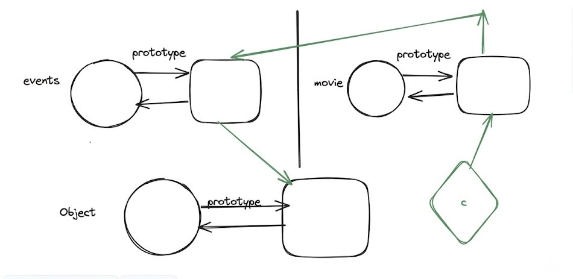

# JavaScript Prototypes: Complete Notes

---

## 1. Class-Based Blueprints vs. JavaScript's Live Linking

In traditional Object-Oriented Programming (OOP) languages like Java or C++, a **class acts as a pure blueprint**. When you instantiate an object, a complete copy of that blueprint is generated. Consequently, if you modify the class later, it does not affect any previously created objects.

In JavaScript, however, modifying a class or a constructor function directly alters or expands the capabilities of previously created objects. This behavior is why many developers state that **JavaScript is not strictly "object-oriented," but rather an "Object Linked to Other Objects" (OLOO) language.** The driving mechanism behind this unique behavior is the **Prototype**.

---

## 2. What is a Prototype?

A **Prototype** is the built-in mechanism in JavaScript that allows objects to share properties and methods with one another.

For example, if we create a plain object `x = {}` and call `x.toString()`, it returns `"[object Object]"`. Even though we never explicitly defined a `toString` method inside our object `x`, we can still access it. This works because JavaScript automatically looks up the method along the object's **prototype chain**.

---

## 3. The Under-the-Hood Internal Setup

JavaScript automatically handles a great deal of object setup behind the scenes:

- **The Built-in `Object` Function:** JavaScript automatically sets up a global constructor function named `Object`.
- **The Anonymous Prototype Object:** Alongside this function, JavaScript creates a special, unnamed companion object containing native implementations of fundamental methods like `toString()`, `isPrototypeOf()`, and `valueOf()`.
- **Accessing the Companion Object:** Because this companion object does not have a distinct name, it is accessed via the property: `Object.prototype`.
- **The Circular Link:** This companion object features a built-in function called a `constructor`. If you call `Object.prototype.constructor`, it points right back to the original `Object` function.

```javascript
// Accessing the companion object
console.log(Object.prototype);
// Output: {toString: ƒ, valueOf: ƒ, hasOwnProperty: ƒ, …}

// Accessing the constructor
console.log(Object.prototype.constructor);
// Output: ƒ Object() { [native code] }
```


> The diagram above shows what happens inside JS while running your code. The `Object` function and its companion prototype object form a circular link via `constructor`. Your custom `Product` function works the same way — its prototype object holds `display()` and `constructor()`, and a plain object created with `new Product()` links to it via a hidden `[[Prototype]]` link.

---

## 4. Custom Code Setup (Functions and Classes)

The exact same internal behavior occurs when we define our own functions or classes.

### Using a Function

When we create a custom function, JavaScript automatically creates a companion prototype object for it.

```javascript
function Product() {}

console.log(Product.prototype);
// Output: { constructor: ƒ Product() }
```

### Using a Class

When using ES6 classes, any methods defined inside the class are automatically assigned to that companion prototype object.

```javascript
class Product {
    display() {}
}

console.log(Product.prototype);
// Output: { display: ƒ, constructor: class Product }
```

Just like the native setup, `Product.prototype.constructor` points directly back to our original `Product` class or function.

---

## 5. Why `display()` Exists on `Product.prototype` and Not `p`

When you write a class method inside a class body, it is automatically assigned to the prototype rather than the instance:

```javascript
class Product {
    constructor(n) {
        this.name = n;       // Assigned directly to the instance
    }
    display() {
        console.log(this);   // Assigned to the prototype
    }
}
const p = new Product("iphone");
```

If you log `p`, you only see `Product {name: 'iphone'}`. The `display()` method **does not exist directly on the plain object `p`**.

### Why JavaScript does this: Memory Optimization

If you create 1,000 products, each instance gets its own unique `name` property. However, they all share a **single copy** of the `display()` function located at `Product.prototype`. This saves an enormous amount of system memory.

---

## 6. Setting Methods: Instance vs. Prototype

### Case A: Methods inside the constructor (Duplicated in Memory)

If you explicitly attach a method to `this` inside the constructor:

```javascript
class Product {
    constructor(n) {
        this.name = n;
        this.display = function() { console.log(this); };
    }
}
```

**Result:** Every single new object created will get its own separate copy of the `display` function physically attached to it. The prototype chain is **not** utilized for this method.

### Case B: Methods added to the Prototype (Shared in Memory)

If you add it outside the constructor or via a class declaration:

```javascript
Product.prototype.display = function() { console.log(this); };
```

**Result:** The method lives on `Product.prototype`. If you dynamically modify this prototype method later, **all existing instances (even older ones)** instantly execute the updated code because they share a live reference to it.

---

## 7. The Call-Site Problem and The Hidden Link (`__proto__`)

If you try to bypass the automatic lookup and call the method directly from the prototype entity:

```javascript
Product.prototype.display();
```

The call-site is now `Product.prototype`. Consequently, the `this` keyword inside `display()` points to the prototype object itself, **not** your instance `p`. You lose your specific instance data (`this.name` will be `undefined`).

To inspect the hidden link that resolves this lookup on an instance, JavaScript historically provided an accessor property:

### The Story of `__proto__` (Dunder Proto)

- **What it is:** `__proto__` is a legacy getter/setter property that exposes the internal `[[Prototype]]` link of an object.
- **Current Status in Modern JS:** While `p.__proto__` still works in browsers for compatibility reasons, it is **deprecated** because mutating an object's prototype via `__proto__` causes severe performance slowdowns in modern JS engines.
- **The Modern Standard:** To inspect or safely handle prototype links today, you should use standard methods:
  - `Object.getPrototypeOf(p)` — to read the prototype link
  - `Object.setPrototypeOf(obj, prototype)` — to change it
  - `Object.create(prototype)` — to build an object with a specific link

---

## 8. Prototypal Inheritance & The `extends` Keyword

In software engineering, inheritance allows us to share common business logic. Imagine building an application like *BookMyShow* where users can book a **Movie**, a **Comedy Show**, or a **Concert**. Instead of rewriting duplicate ticketing code three times, we consolidate the shared logic inside a parent class called `Events`.


> The diagram above shows `Events.prototype` (with `bookEvents()`) sitting as the **parent**. The `movie`, `comedy`, and `concert` prototypes are all **children** that inherit from it.

When you use the modern `extends` keyword in JavaScript:

```javascript
class Events {
    bookEvent() {
        console.log("Event booked successfully!");
    }
}

class Movie extends Events {
    showtime() {
        console.log("Showtime set...");
    }
}

const m = new Movie();
```

Under the hood, `extends` configures a multi-layered prototype chain by connecting the child's companion object to the parent's companion object:

```
m.__proto__                →  Movie.prototype
Movie.prototype.__proto__  →  Events.prototype
Events.prototype.__proto__ →  Object.prototype
```


> The diagram above shows the complete chain. The `movie object` (diamond) links up to `Movie.prototype`, which links to `Events.prototype`, which links to `Object.prototype` — all the way at the top.

### Walking the Chain: Executing `m.bookEvent()`

When you run `m.bookEvent()`:

1. JS checks the local object `m`. **(Not found)**
2. JS moves up the hidden link to check **`Movie.prototype`**. **(Not found)**
3. JS moves up another level to check **`Events.prototype`**. **(Found!)** The method executes seamlessly while ensuring `this` correctly points back to your specific movie instance `m`.
4. If it weren't there, it would check **`Object.prototype`**, and finally stop at `null` (returning `undefined`).

---

# JavaScript Prototypal Inheritance: Constructor Stealing & `this` Binding

---

## Part 1 — Constructor Stealing & Property Chaining

---

### 1. Object Creation via `Object.create()`

Instead of manually mutating an existing prototype object using the deprecated `__proto__` accessor, JavaScript provides `Object.create(proto)`. This method instantiates a brand-new plain object and seamlessly links its internal `[[Prototype]]` hidden link directly to the target object passed as the argument.

```javascript
function Event() {}
Event.prototype.bookEvent = function() {
    console.log("Booking event...");
};

function Movie(name) {
    this.name = name;
}

// Automatically creates a clean prototypal chain link
Movie.prototype = Object.create(Event.prototype);

const c = new Movie("Deadpool");
c.bookEvent(); // Output: Booking event...
```



> The diagram above shows the full prototype chain wired up cleanly: the `movie` instance (`c`, the green diamond) links to `Movie.prototype`, which links to `Event.prototype`, which links to `Object.prototype`. The green arrows show the lookup pipeline that makes `c.bookEvent()` work.

*Behind the scenes, `Object.create()` achieves the exact same look-up pipeline as `__proto__`, but in a clean, standardized, and engine-optimized way.*

---

### 2. Why Modifying `__proto__` Directly is Discouraged

While writing `Movie.prototype.__proto__ = Event.prototype` works in a console, manually reassigning `__proto__` on an already existing prototype object is discouraged in production. Modern JavaScript engines (like V8) optimize property lookups based on the shape of objects at initialization time. Changing a prototype link **after** the object has already been created forces the engine to abandon those optimizations, slowing down lookups across your entire application.

**Quick Reference:**

| Approach | Syntax | Verdict |
|---|---|---|
| **Dunder Proto (Legacy)** | `Movie.prototype.__proto__ = Event.prototype` | Deprecated & slow |
| **Object Creation** | `Movie.prototype = Object.create(Event.prototype)` | Standard for ES5 inheritance |
| **Dynamic Mutation** | `Object.setPrototypeOf(Movie.prototype, Event.prototype)` | Standard for mutating existing chains |

---

### 3. Parent Property Inheritance (Avoiding Duplicate Code)

Linking prototypes only shares *methods*. It does **not** automatically pass down instance properties initialized inside the parent constructor (like `this.dateOfEvent`). To avoid rewriting those assignments in every child constructor, we invoke the parent constructor's logic from within the child's context — this pattern is called **Constructor Stealing**.

#### A. The ES6 Class Paradigm (`super`)

Within a class constructor, the `super()` keyword points directly to the parent class constructor, passes the required arguments up, and maintains the correct `this` context.

```javascript
class Events {
    constructor(dateOfEvent) {
        this.dateOfEvent = dateOfEvent;
    }
}

class Movie extends Events {
    constructor(movieName, movieDate) {
        super(movieDate); // Triggers parent constructor
        this.movieName = movieName;
    }
}

let dp = new Movie("Deadpool", "01-07-2026");
console.log(dp);
// Output: Movie { dateOfEvent: '01-07-2026', movieName: 'Deadpool' }
```

#### B. The Classical Function Paradigm (`Constructor Stealing`)

Because classic constructor functions cannot resolve the `super` keyword, we replicate this behavior manually using `.call()`. By executing `Events.call(this, movieDate)`, the parent function runs its property assignments directly on the child's `this` reference.

```javascript
function Events(dateOfEvent) {
    this.dateOfEvent = dateOfEvent;
}
Events.prototype.bookEvent = function() {
    console.log("Booking Event...");
};

function Movie(movieName, movieDate) {
    Events.call(this, movieDate); // Replicates 'super(movieDate)' behavior
    this.movieName = movieName;
}

// Link the prototype chains together
Movie.prototype = Object.create(Events.prototype);
Movie.prototype.constructor = Movie; // Restore the constructor link

let ironMan = new Movie("Iron Man", "27-09-2026");
console.log(ironMan);
// Output: Movie { dateOfEvent: '27-09-2026', movieName: 'Iron Man' }
```

> **Critical Step:** `Object.create()` completely replaces the old prototype object, which breaks the circular `constructor` link. You must manually restore it with `Movie.prototype.constructor = Movie`.

---

### 4. How JavaScript Handles Unassigned Arguments

If a constructor expects arguments that you fail to supply during instantiation, JavaScript does not throw an error. Instead, it assigns those missing arguments the primitive value of `undefined`.

```javascript
// Expects two parameters, but only passing one
let standardMovie = new Movie("Avengers");

console.log(standardMovie.movieName);   // Output: "Avengers"
console.log(standardMovie.dateOfEvent); // Output: undefined
```

**Why this happens:**

1. When `new Movie("Avengers")` is invoked, the `movieDate` parameter variable is declared in memory but initialized without a value.
2. In JavaScript, all unassigned variables automatically hold the value `undefined`.
3. When `Events.call(this, movieDate)` executes, it translates to `this.dateOfEvent = undefined`, attaching the key to the instance with a blank state.

---

## Part 2 — Mastering `this`, `call`, `apply`, and `bind`

---

### 1. Understanding the `this` Keyword Behavior

In JavaScript, the behavior of `this` changes dramatically depending on how a function is declared:

- **Normal Functions:** The value of `this` is determined dynamically at runtime based entirely on the function's **call-site** — how and where the function is executed.
- **Arrow Functions:** Arrow functions do not have their own `this` context. Instead, they resolve `this` **lexically** by inheriting it directly from the enclosing block where the arrow function was originally authored.

---

### 2. Explicitly Binding Context: `call`, `apply`, and `bind`

JavaScript provides three built-in methods on the function prototype to manually control what `this` points to.

> **Important:** These explicit binding methods **only work on normal functions**. Because arrow functions resolve `this` lexically, using `call`, `apply`, or `bind` on them is silently ignored.

#### A. The `call` Method

Invokes a function **immediately**, swapping its default `this` context with a custom target object passed as the first argument. Additional arguments follow as a comma-separated list.

```javascript
const obj = {
    firstName: "Ubair",
    greet: function(welcomeMessage, question) {
        console.log(`Hello, my name is ${this.firstName}. ${welcomeMessage} ${question}`);
    }
};

const newObj = { firstName: "Sarthak" };

obj.greet.call(newObj, "How are you?", "How can I help you?");
// Output: Hello, my name is Sarthak. How are you? How can I help you?
```

- **Missing first argument:** If no target object is passed, `this` defaults to the **global object** (`window` in browsers, `global` in Node.js).
- **Non-destructive:** `.call()` runs the method under a temporary context; it does not mutate the original function.

#### B. The `apply` Method

Works identically to `call()`, except extra parameters are passed as a **single array** rather than a comma-separated list.

```javascript
obj.greet.apply(newObj, ["How are you?", "How can I help you?"]);
// Output: Hello, my name is Sarthak. How are you? How can I help you?
```

#### C. The `bind` Method

Unlike `call()` and `apply()`, `bind()` does **not** invoke the function immediately. Instead, it returns a **brand-new function wrapper** with `this` permanently locked to the provided target. This new function can be stored and invoked later.

```javascript
const boundGreet = obj.greet.bind(newObj);

boundGreet("Hello!", "Nice to meet you.");
// Output: Hello, my name is Sarthak. Hello! Nice to meet you.
```

---

### 3. Resolving Nested Context Scopes

When a normal method contains a nested inner function, that inner function loses track of the parent object's `this`. There are two established patterns to fix this:

#### Modern Solution: Lexical Arrow Functions

Arrow functions inherit `this` directly from their enclosing lexical context, so an inner arrow function seamlessly reads the `this` value of its parent method.

```javascript
let obj = {
    name: 'xyz',
    greet: function() {
        const arr = () => {
            console.log('hello', this.name); // Inherits 'this' from greet()
        };
        arr();
    }
};
obj.greet(); // Output: hello xyz
```

#### Legacy Solution: Variable Closure (`const self = this`)

Before ES6, developers manually saved the active `this` reference into a variable (typically `self` or `that`). The inner function accesses it via a standard closure.

```javascript
let obj = {
    name: 'xyz',
    greet: function() {
        const self = this; // Capture the correct context manually
        const arr = function() {
            console.log('hello', self.name); // Access via closure variable
        };
        arr();
    }
};
obj.greet(); // Output: hello xyz
```